# PATIML  - 

##### I suggest using "Main Backup File. NT88K"  I think there something to it w/ AC4, AC4+, etc etc way Conner has it setup!  My model using this strategy w/out his indicators does not work as good!

1)  SIERRALINK VPS user delete everthing in Documents/NinjaTrader 8/db/
2)  Download Historical Data
3)  Add all indicators, if any.  No going back after this step without re-training!
4)  If your using Conner Template, NQ only!  Change AC4 & AC4+ Imbalance Mode to "Horizontal"
5)  We ready to train!
6)  Create models "Trend & Regression".
7)  Open PATIML.app
8)  Set DATA Series to 30 Days
9)  Step Only Needed for Model to use in different Time Zones!  Open Ninja Script Editor add // in front of AddPlot(Brushes.Transparent, "TIMEOfDAY"); Also // where you see it in 2nd picture & compile:
  
   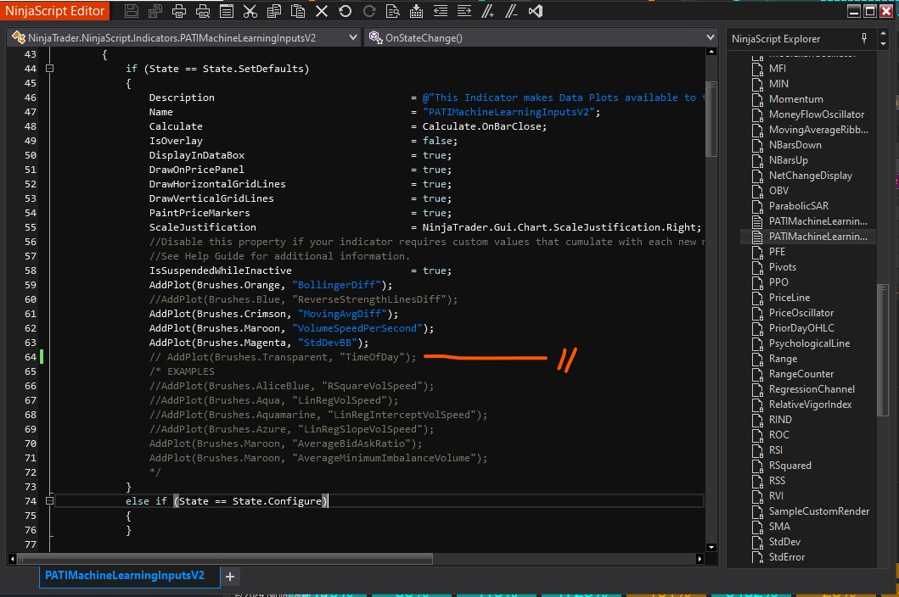
   
and here:

   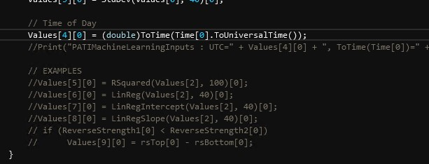

10) Goto Strategies, use Conner Template and unCheck "Use PolanityATI Trades" & "Optimize Settings" for 1st part of training.  In picture I name mine PrePack to share w/ friend in differet TimeZone.  Do not get this confuse w/ Conner.
    
    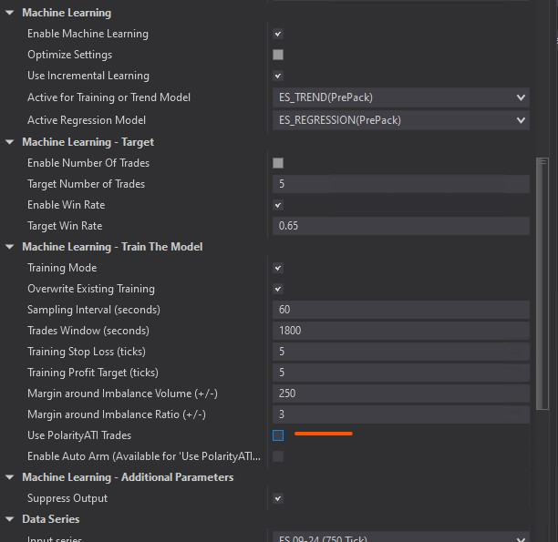

11) Enable and watch file grow!  ConnerMLtrain_kjsdfskljdhflsda?????.csv

    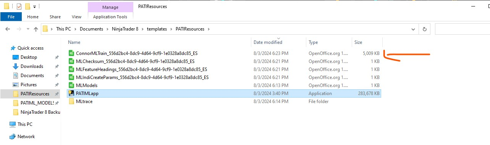

12) Lets tweak it.  Copy & paste into Documents!  Leave it there, you will need it agian for Regression Training:

    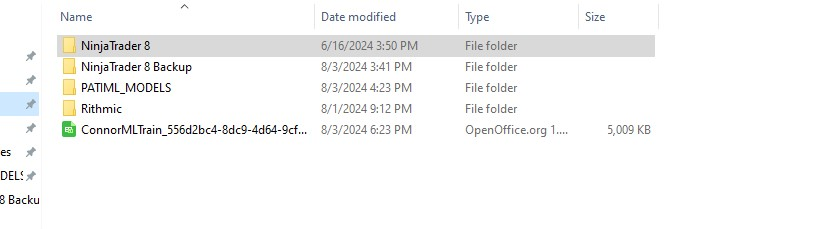

    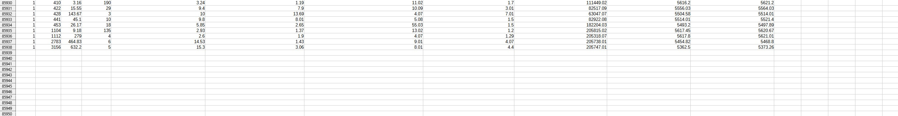

13) No Need to playback and train model now!  8k lines w/ 65% higher win rate!  Just got practice on SIM account!  Still got to know when to switch MODES!  If you remove "Time Of Day"  ML will get better over time if you add it back!  Untested theory at moment!  Removing "TimeOfDay" only way to get around TimeZones for Custome Model to work any where! 

    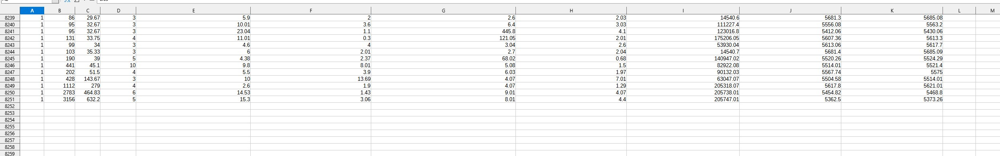

14) Back to Stratiges:  Check "Use PolanityATI Trades!  Apply!  then Enable!  Apply Again!

    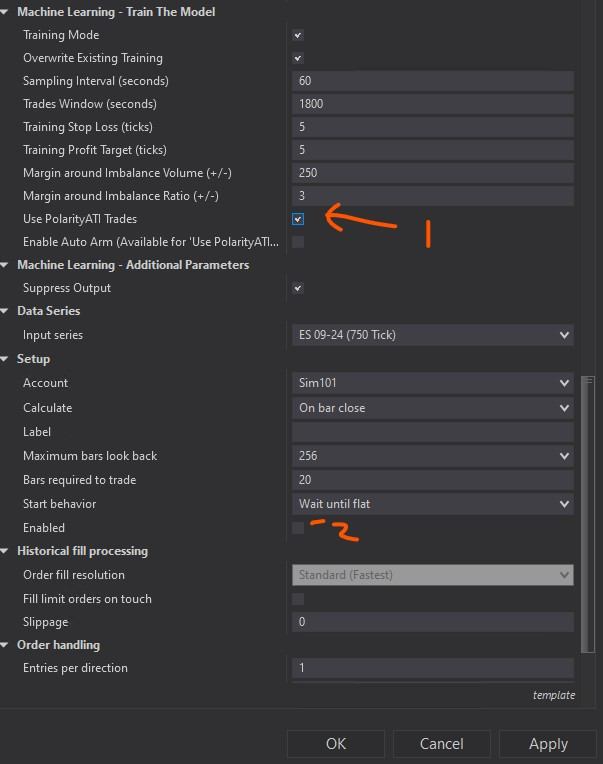

15)  Delete or save if you want the ConnerMLtrain_kjsdfskljdhflsda?????.csv.  Copy Paste tweak version into PATIResources folder.  Hit Train:

   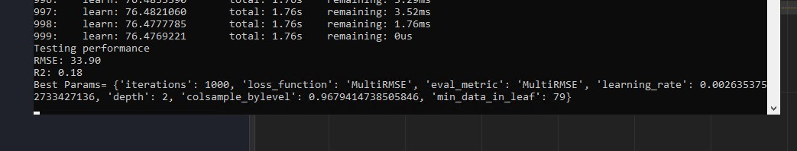

   See Score w/ indicators? 

16) Reverse Step 14 with Regression.  Switch with Trend in Strategies:  You can do it just like Picture!

  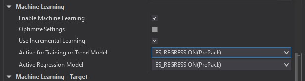

17)  Apply!  then Enable!  Apply Again!  Hit Train!

18)  Copy new ConnerMLTRAIN_eeeecddefgks????.csv name only.  Name needs to match!   You are re-using tweak version in documents just change name.  Delete it or save new ConnerMLTRAIN_???.csv version in PATIResources folder.  There needs to be 2 ConnerMLTRAIN_eeeecddefgks????.csv  with different names in PATIResources Folder when you finish!  Copy & paste new tweak version into PATIResources Folder.  If you see 2, you are good!  Hit train!

  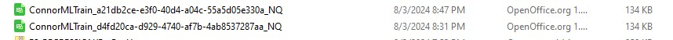

19)  Training Done!  Export Orginal Model!

20)  Ready for "Optimize Settings"  make your setting look like the picture!  DO NOT ENABLE!!!!!  If you need to fix "TimeOfDAY"

  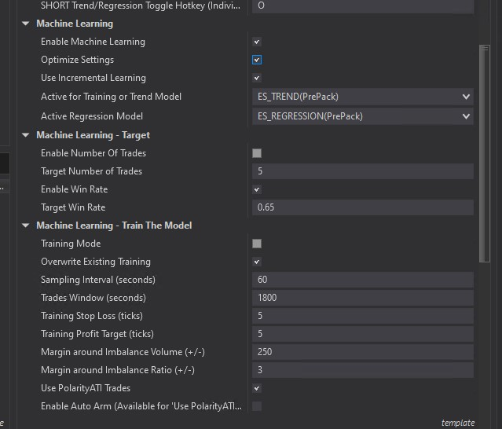

21)  Fix "TimeOfDAY" with Ninja Script Editor.

  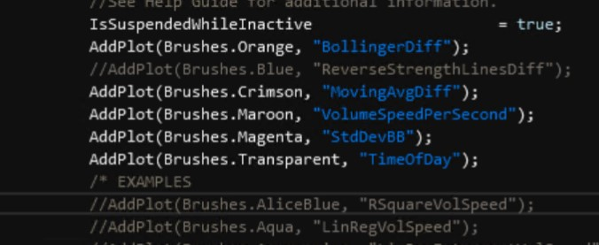

22) Now Enable, Wait!!!!  When you see "Heuristic Parameter Optimization ON"  Open Data Series and change "Days to Load" to what ever you prefer!

####  Done!  

ML should work way better!   NQ works better than ES.  Might be size of file or setting.  Time will tell.

It should learn base off how you trade!  Happy Trading
    

    
    
